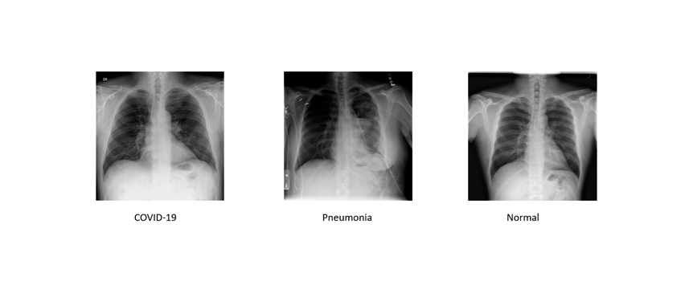
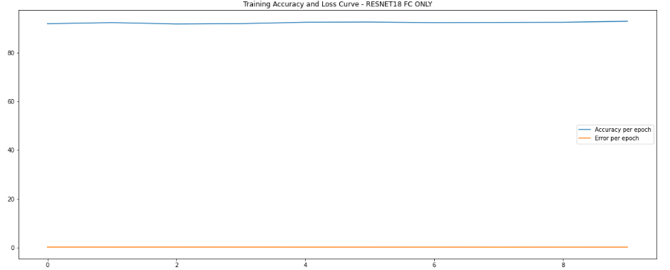

# MSDS19042_COVID19_DLSpring2020
## COVID-19 Classification
In this, I have tried to experiment on few thousand X-Rays of Normal and COVID-19 patients. RESNET18, VGG16 are the two pretrained models that I have chosen for this and done two different experiments.

## Dataset:
New studies [1] have revealed that the damage done to lungs by infections belonging to the family of coronaviruses (COVID-19, SARS, ARDS etc.) can be observed in X-Ray and CT scan images. With a worldwide shortage of test kits, it is possible that careful analysis of X-Ray and CT scan images may be used in diagnosis of COVID-19 and for the regular assessment while they are recovering. In this assignment, we will use an open source dataset of X-Ray images and train a Convolutional Neural Network to try and detect instances of infections containing COVID-19 and Pneumonia.

### Dataset Details: 
This dataset contains X-Ray images from 2 classes:
 Copy to clipboard  Preview
| Class    	| # of images in training set 	| # of images in validation set 	| # of images in test set 	|
|----------	|-----------------------------	|-------------------------------	|-------------------------	|
| Infected 	| 4919                        	| 615                           	| 615                     	|
| Normal   	| 7081                        	| 885                           	| 885                     	|

Dataset is available on this following link: https://drive.google.com/open?id=1-HQQciKYfwAO3oH7ci6zhg45DduvkpnK

## Fine-tuning Models:
In PyTorch, each layer's weights are stored in a Tensor. Each tensor has an attribute called ‘requires_grad’, which specifies if a layer needs training or not. In fine-tuning tasks, we freeze our pre-trained networks to a certain layer and update all the bottom layers. In PyTorch we can loop through our network layers and set ‘requires_grad’ to False for all the layers that we want to be freezed. We will set ‘requires_grad’ to True for any layer we want to fine-tune. 

## Task Details:
So in these two tasks, I have to fine tuned the layers in the models. So first, I just fetched the pre trained models of RESNET18 and VGG16. In both models, I just delete the last Fully Connected (FC) Layer and then fine tuned the output FC Layer according to my dataset as the pretrained models were trained on 1000 class outputs while here we had only two classes i.e. (Infected, Normal) so I added two new FC layers. One was the layer with the size of 4300 neurons because the formula for this one was (Last two digits of My University Roll Number (42 is mine) * 100 + 100 ), and the last one was the layer with 2 neurons as output because of our classes. This process is done in both models. For RESNET18 the Training Accuracy/Loss Curves are:

## Trained Models:
All the trained models can be found at: https://drive.google.com/open?id=1Vh9kLEUMKrnnYqpGTaPxx8gA7j-Pyx90

### Analysis on each task and comparison of experiments to each other:
In task 1, when we only trained only last layer, it caused a lot of over fitting in both models and the accuracy was too high but again data for COVID19 is too small and too similar to pneumonia. While when I just unfreeze few CNN layers in task 2 models learn few more, but the overfitting was still the problem as we can see in the notebook and images above. Similarly even on fully unfreezed models was still causing the problems of overfitting but far less because of the data as it is too young and immature.

