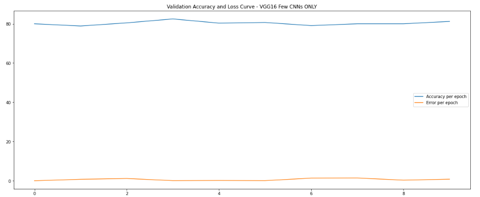
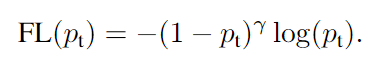
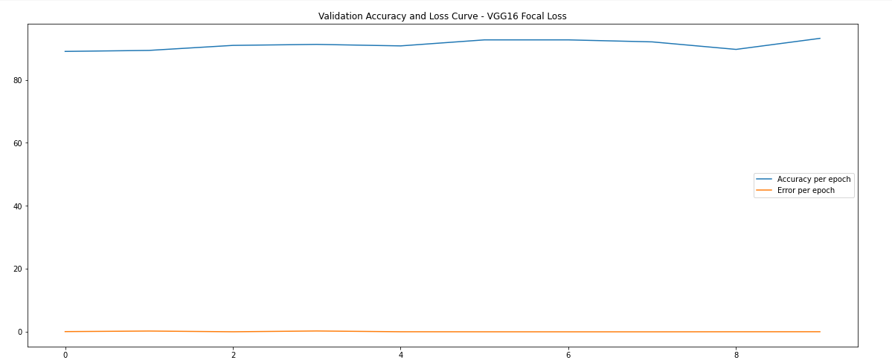

# MSDS19042_COVID19_DLSpring2020
## COVID-19 Classification
This repository contains code and results for COVID-19 classification assignment by Deep Learning Spring 2020 course offered at Information Technology University, Lahore, Pakistan. This assignment is only for learning purposes and is not intended to be used for clinical purposes
In this, I have tried to experiment on few thousand X-Rays of Normal and COVID-19 patients. RESNET18, VGG16 are the two pretrained models that I have chosen for this and done two different experiments.

## Dataset:
New studies [1] have revealed that the damage done to lungs by infections belonging to the family of coronaviruses (COVID-19, SARS, ARDS etc.) can be observed in X-Ray and CT scan images. With a worldwide shortage of test kits, it is possible that careful analysis of X-Ray and CT scan images may be used in diagnosis of COVID-19 and for the regular assessment while they are recovering. In this assignment, we will use an open source dataset of X-Ray images and train a Convolutional Neural Network to try and detect instances of infections containing COVID-19 and Pneumonia.

### Dataset Details: 
This dataset contains X-Ray images from 2 classes:
 Copy to clipboard  Preview
| Class    	| # of images in training set 	| # of images in validation set 	| # of images in test set 	|
|----------	|-----------------------------	|-------------------------------	|-------------------------	|
| Infected 	| 4919                        	| 615                           	| 615                     	|
| Normal   	| 7081                        	| 885                           	| 885                     	|

Dataset is available on this following link: https://drive.google.com/open?id=1-HQQciKYfwAO3oH7ci6zhg45DduvkpnK

## Fine-tuning Models:
In PyTorch, each layer's weights are stored in a Tensor. Each tensor has an attribute called ‘requires_grad’, which specifies if a layer needs training or not. In fine-tuning tasks, we freeze our pre-trained networks to a certain layer and update all the bottom layers. In PyTorch we can loop through our network layers and set ‘requires_grad’ to False for all the layers that we want to be freezed. We will set ‘requires_grad’ to True for any layer we want to fine-tune. 

## Task Details:
So in these two tasks, I have to fine tuned the layers in the models. So first, I just fetched the pre trained models of RESNET18 and VGG16. In both models, I just delete the last Fully Connected (FC) Layer and then fine tuned the output FC Layer according to my dataset as the pretrained models were trained on 1000 class outputs while here we had only two classes i.e. (Infected, Normal) so I added two new FC layers. One was the layer with the size of 4300 neurons because the formula for this one was (Last two digits of My University Roll Number (42 is mine) * 100 + 100 ), and the last one was the layer with 2 neurons as output because of our classes. This process is done in both models. 

### Experimental Setup: 
Learning rate = 0.001 , number of layers fine-tuned = varies on the model and number of epochs: 10 

#### For RESNET18: 
The Training Accuracy/Loss Curves are:

Similarly the Validation Curves are:

#### For VGG16
The Training Accuracy/Loss Curves are:

Similarly the Validation Curves are:

Next I unfreezed few CNN Layers from both models and repeated the same process again and then in the end I unfreezed all layers and trained again on both models 

#### For RESNET18: 
The Training Accuracy/Loss Curves are:

Similarly the Validation Curves are:

#### For VGG16
The Training Accuracy/Loss Curves are:

Similarly the Validation Curves are:

## Trained Models:
For each step The models, i have trained, were dumped on the google drive. All the trained models can be found at: https://drive.google.com/open?id=1Vh9kLEUMKrnnYqpGTaPxx8gA7j-Pyx90

### Analysis on each task and comparison of experiments to each other:
In task 1, when we only trained only last layer, it caused a lot of over fitting in both models and the accuracy was too high but again data for COVID19 is too small and too similar to pneumonia. While when I just unfreeze few CNN layers in task 2 models learn few more, but the overfitting was still the problem as we can see in the notebook and images above. Similarly even on fully unfreezed models was still causing the problems of overfitting but far less because of the data as it is too young and immature.

## Part 02
In this task we have to finetune again those same two pre trained models: VGG16 & RESNET18. But this time we had different dataset as:
### Dataset
In second notebook, We have different dataset containing multi-label and multi-class data as:
| Class     	| Training Set 	| Validation Set 	|
|-----------	|--------------	|----------------	|
| COVID-19  	| 200          	| 28             	|
| Pneumonia 	| 2000         	| 200            	|
| Normal    	| 4000      	| 400            	|

The Test set contains 629 samples that are unlabelled. Your task is to train a model using the above two subsets and submit a .csv file containing predictions for the Test set.

Link: https://drive.google.com/file/d/1eytbwaLQBv12psV8I-aMkIli9N3bf8nO/view?usp=sharing

### Task:
lti-label classification refers to the situation where a single image can have multiple labels. In this assignment, for example, COVID-19 is a special type of Pneumonia. However these are two different classes and a single image can belong to both the classes. Each class will have a separate neuron (classifier).
In this multi-class and multi-label problem, we have to use Focal Loss rather than conventional cross entropy loss as compared to first two task. Since this is a multi-label classification, we could not use softmax on the last FC layer.  For this we just cannot use the simple cross-entropy as it does not work with multi-label problem so we used BCEWithLogitsLoss because this loss accepts one-hot vectors for targets. This loss automatically applies a sigmoid function.

### Results:
### Experimental Setup: 
Learning rate = 0.001 , number of layers fine-tuned = varies on the model and number of epochs: 10 

#### For RESNET18: 
The Training Accuracy/Loss Curves are:

Similarly the Validation Curves are:

##### Confusion Metrices:

Similarly the Validation Metrices are:

#### For VGG16
The Training Accuracy/Loss Curves are:

Similarly the Validation Curves are:

##### Confusion Metrices:

Similarly the Validation Metrices are:

## Focal Loss:
Originally invented by Facebook for Object Detection in RetinaNet [link], focal loss aims at penalizing hard examples more than easy examples. Easy examples are the ones which are classified at a high probability by the network. For example background class in object detection is much abundant as compared to foreground objects. The background class does not have many complex patterns and thus easily distinguished by the classifier. Moreover the more the samples of the background class, the more the model bias towards it. Focal loss was designed to tackle this problem. Here we will present focal loss for a binary class problem. It can be extended to a multi-class problem just as binary cross entropy is extended to multi-class cross-entropy.
Consider the following Cross entropy formula:

y is either 1 (class 1) or 0 (class 2). p is the predicted probability in the range [0,1].  We can write this cross entropy loss as CE(p,y) = CE(pt) = −log(pt). Where pt is written as:

Focal loss is now defined as:

Here we subtract the original probability from 1. Thus if a class was predicted with high probability, subtracting it from 1 makes it close to 0. Thus its importance in the loss is reduced. Thus our model is not biased towards classes having abundant data which are easy to predict and hence does not ignore the classes with small amounts of data (which are hard to classify). The gamma in the exponent is the focusing parameter. If gamma = 0, then FL becomes the standard CE loss. For gamma > 0, the FL exhibits different behaviors (by deciding how much to penalize the hard and easy examples.)

##### Note: Here we are going to use Focal Loss instead of BCEWithLogitsLoss

### Results:
### Experimental Setup: 
Learning rate = 0.001 , number of layers fine-tuned = varies on the model and number of epochs: 10 

#### For RESNET18: 
The Training Accuracy/Loss Curves are:

Similarly the Validation Curves are:

##### Confusion Metrices:

Similarly the Validation Metrices are:

#### For VGG16
The Training Accuracy/Loss Curves are:

Similarly the Validation Metrices are:

##### Confusion Metrices:

Similarly the Validation Curves are:

### Trained Models:
For each step The models, i have trained, were dumped on the google drive. All the trained models can be found at: https://drive.google.com/open?id=1yxjWBMZTxeEOsiPQ-zet3OBOMQU9uDjJ

### Analysis:
Focal Loss has helped models to understand more than BCELoss and we get better results than the simple loss function. Alpha = 1 and gamme = 2 gave the best results in experiments. While using focal loss, models were training more accurately than BCELoss as there was less overfitting problems and accuracy was going better.